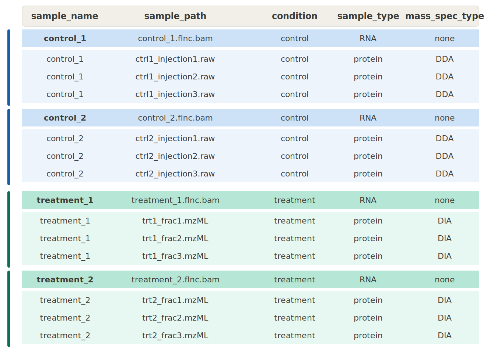

# Preparing Input Data

## Input File Requirements

**RNA samples** must be provided as **PacBio full-length non-chimeric (FLNC) reads** as outputted by PacBio Isoseq refine, in either BAM or FASTQ format. It is assumed that input files are **post-processed** and have already undergone deconcatenation, demultiplexing, and primer removal. **Do NOT** provide raw subreads or CCS reads directly from the sequencer.

**Protein samples** may be either **DDA** or **DIA**, and can be provided in `.mzML` format or vendor-specific raw formats.

## Samplesheet Structure

Prepare a comma-delimited samplesheet (.csv) describing your input data:



### Samplesheet Columns

| Column | Description |
|--------|-------------|
| `sample_name` | Each RNA sample must have a distinct value. Do not include any spaces in this value. |
| `sample_path` | Absolute path to the input file.<br>• RNA samples should be PacBio FLNC `.bam` or `.fastq` files<br>• Protein samples should be `.raw` or `.mzML` files |
| `condition` | Sample group (e.g., "control", "treatment"). Used for differential analysis, which performs pairwise comparisons between groups. Two or more groups are supported. If you do not want differential analysis, assign the same condition to all samples. Do not include any spaces in this value. |
| `sample_type` | Must be either `RNA` or `protein`. |
| `mass_spec_type` | Must be either `DDA` or `DIA`. Required for protein samples. For RNA samples, specify `none` for this column. |

## Sample Naming Conventions

!!! important "Naming Rules"
    **RNA samples**: Each RNA sample must have a unique `sample_name`. These are used by Isocall to label count matrix columns.

    **Protein samples**: All raw files from the same biological sample (e.g., multiple fractions or injection replicates) must share the same `sample_name` so they are combined and searched together in FragPipe.

    **Matched RNA + protein samples**: Use the same `sample_name` for the RNA and protein entries. The predicted proteome from that sample will be included in the proteomics search database.

    **Unmatched protein samples**: If a protein sample has no matched RNA sample, assign it a `sample_name` that does not match any RNA sample. In this case, only the GENCODE reference proteome will be used as the proteomics search database.

## Example Samplesheet

```csv
sample_name,sample_path,condition,sample_type,mass_spec_type
K562_rep1,/path/to/K562_rep1.bam,K562,RNA,none
K562_rep2,/path/to/K562_rep2.bam,K562,RNA,none
HepG2_rep1,/path/to/HepG2_rep1.bam,HepG2,RNA,none
HepG2_rep2,/path/to/HepG2_rep2.bam,HepG2,RNA,none
K562_rep1,/path/to/K562_rep1_F1.raw,K562,protein,DDA
K562_rep1,/path/to/K562_rep1_F2.raw,K562,protein,DDA
HepG2_rep1,/path/to/HepG2_rep1.raw,HepG2,protein,DDA
```

In this example:

- Two RNA samples per condition (K562 and HepG2)
- K562 protein sample has 2 fractions that will be searched together
- HepG2 protein sample has 1 file
- RNA and protein samples are matched by `sample_name`
